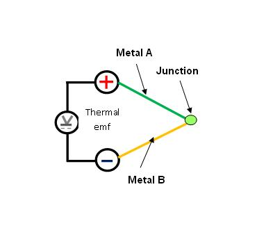
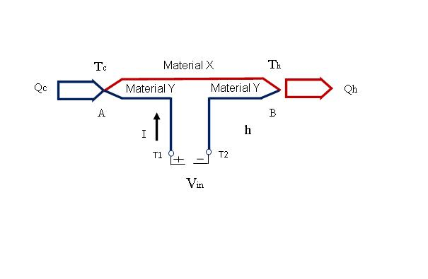
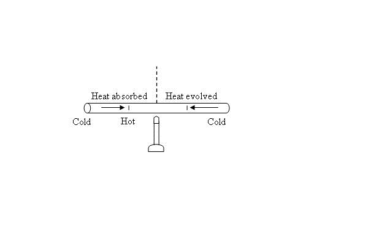

# Theory
**Prerequisite**

Before performing the experiments on thermocouples, students must have knowledge of:
1. Importance of temperature measurement
2. Different temperature scales
3. Various methods of temperature measurement

**Thermoelectric Effect**

The thermoelectric effect is the direct conversion of temperature differences to electric voltage and vice versa. A thermoelectric device creates a voltage when there is a difference in temperature on each side. Conversely when a voltage is applied to it, it creates a temperature difference.

There are three basic effects that explain the working principle of a thermoelectric device.
1. **Seebeck Effect:** When two wires composed of dissimilar metals are joined at both ends and one of the ends is heated, there is a continuous current which flows in the thermoelectric circuit. German-Estonian physicist Thomas Seebeck made this discovery in 1821. This is now known as the **thermoelectric effect** or **Seebeck effect**.

2. **Peltier Effect:** Peltier found that the junctions of dissimilar metals get heated or cooled, depending upon the direction in which an electrical current passed through them. Heat generated by current flowing in one direction is absorbed if the current is reversed. The effect always involves pairs of junctions. The Peltier effect is found to be proportional to the first power of the current, not to its square, as is the irreversible generation of heat caused by resistance throughout the circuit. In effect it transfers the heat from one side of a device to other.

 

3. **Thompson Effect:** This describes the existence of temperature gradient while heating or cooling of a conducting material. Any current - carrying conductor (except superconductor), with a temperature difference between two points, will either absorb or emit heat, depending on the material.

**Introduction to Thermocouple**

**What is thermocouple?**
A thermocouple is a junction between two different metals that produces a voltage related to a temperature difference. When two wires composed of dissimilar metals are joined at both ends and one of the ends is heated, there is a continuous current which flows in the thermoelectric circuit (the thermoelectric effect or Seebeck effect).

**Need for reference junction( cold junction):**
In thermocouples, voltage is developed due to flow of electric current. This current flow depends upon the difference in temperatures at the two ends of conducting wire. That is thermocouples always measure difference in temperatures and not absolute temperature.

To measure the temperature of one junction, the other junction is kept at some reference temperature. As this is done by using ice bath, it is normally called at cold junction.

Using ice bath for constant temperature is useful for laboratory calibration, but is not convenient for most measurement and control applications. Instead of ice bath, an effect of cold junction is added using a thermally sensitive device such as a thermistor or diode. This is also called as isothermal block. Special care is taken to minimize any temperature gradient between terminals. Hence, the voltage from a known cold junction can be simulated, and the appropriate correction is applied. This is known as cold junction compensation.

**Software compensation** is the most versatile technique used for measuring thermocouples. Many thermocouples can be connected on the same block. The technique is independent of the types of thermocouples. All of the conversions are performed by the computer. The disadvantage is that the computer requires additional time to calculate the reference junction temperature. For maximum speed we can use hardware compensation.

**Hardware compensation** can be viewed as inserting a battery that cancels the offset voltage produced by the reference junction. These commercially available circuits provide an electronic ice point reference. Their main advantage is speed while the disadvantage is that it is suited to compensate only a particular type of thermocouple.

**Thermocouple Properties:**
The selection criteria for thermocouple materials:
1. Temperature Range
2. Melting point
3. Reaction to various atmospheric conditions
4. Thermoelectric output in combination
5. Electrical conductance
6. Stability
7. Interchangeability
8. Repeatability
9. Accuracy
10. Resolution
11. Cost
12. Availability
13. Chemical properties
14. Abrasion and vibration resistance
15. Installation requirements
16. Magnetic properties
17. Ease of handling and fabrication

**Things to remember:**
**Wire Size of Thermocouple :** Selecting the wire size used in the thermocouple sensor depends upon the application. Generally, when longer life is required for the higher temperatures, the larger size wires should be chosen. When sensitivity is the prime concern, the smaller sizes should be used.

**Length of Thermocouple Probe :** Since the effect of conduction of heat from the hot end of the thermocouple must be minimized, the thermocouple probe must have sufficient length. Unless there is sufficient immersion, readings will be low. It is suggested the thermocouple be immersed for a minimum distance equivalent to four times the outside diameter of a protection tube or well.

**Location of Thermocouple :** Thermocouples should always be in a position to have a definite temperature relationship to the work load. Usually, the thermocouple should be located between the work load and the heat source and be located approximately 1/3 the distance from the work load to the heat source.

**Types of thermocouples based on metal combination**
Different types are best suited for different applications. They are usually selected based on the temperature range and sensitivity needed. Thermocouples with low sensitivities (B, R, and S types) have correspondingly lower resolutions.

**Need for thermowell:**
* Thermowells are used in industrial temperature measurement to provide isolation between a temperature sensor (often a thermocouple) and the environment whose temperature is to be measured.

* They are intrusive fittings and are subjected to static and dynamic fluid forces. These forces govern their design. Vortex shedding is the dominant concern as it is capable of forcing the thermowell into flow-induced resonance and consequent fatigue failure. The latter is particularly significant at high fluid velocities.

* Thermowells are used to facilitate the repair of temperature sensing devices without interrupting the process being monitored.

* Thermowells are available in three main barrel or shank design types. The barrel, or shank, is the container style apparatus, which is inserted into the process flow.Since thermowells are inserted directly into the process flow, the goal is to allow for measurement while causing as little restriction of flow as possible.

**When selecting between the available types of thermowells, points considered are:**
* Stem length (length from bore to the end of the well) and bore diameter of the thermowell.
* The temperature and viscosity of the media into which the thermowell will be seated.
* Lagging extensions through which the sensor will have to pass.

**Thermocouple Types:**

| Thermocouple Type | Names of Materials | Useful Application Range | Properties and Applications|
| -------- | -------- | -------- | -------- |
| B | Platinum 30%, Rhodium (+), Platinum 6%, Rhodium(-) | 32-3100F, 0-1700C | Limited use below 50C | 
| C | Tungsten 5%, Rhenium (+), Tungsten 26%, Rhenium (-) | 32-4200F, 0-2300C | Must not be used in presence of oxygen above 260 &deg;C; Well suited for Vacuum Furnaces at extremely high temperatures. |
| E | Chromel(+), Constantan (-) | -200-1650F, -95-900C | Sensitivity 68&mu;V/&deg;C, Non magnetic, Most suited for cryogenic use. |  
| J | Iron (+), Constantan (-) | -58-1650F, -50-900C | Sensitivity 55 &mu;V/&deg;C, Magnetic properties, Restrict use above 770 &deg;C. | 
| K | Chromel (+), Alumel (-) | -328-2300F, -200-1260C | Most common Sensitivity 41 &mu;V/&deg;C, Inexpensive, Linear, Restricted use above 350 &deg;C due to magnetic properties of nickel. |
| R | Platinum 13%,Rhodium(+), Platinum(-) | 160-2640F, 70-1450C | Usually used only for high temperature measurements due to their high cost and low sensitivity. |
| S | Platinum 10%, Rhodium(+), Platinum(-) | 1800-2640F, 982-1450C | Usually used only for high temperature measurements due to their high cost and low sensitivity. |
| T | Copper(+), Constantan(-) | -330-660F, -200-350C | Sensitivity 43 &mu;V/&deg;C, Often used for differential measurement. |

